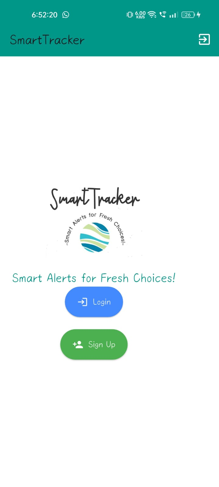
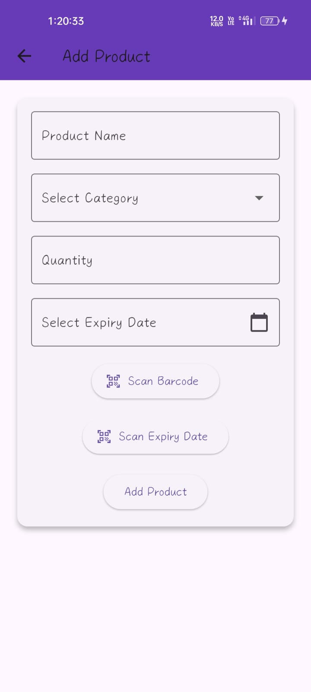
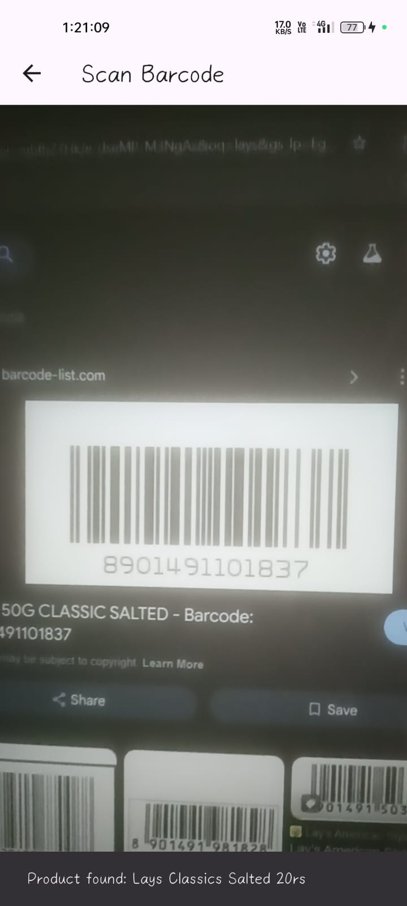

Smart Tracker (SmartT)

    An AI-powered mobile application for expiry date and inventory management that helps individuals and businesses (homes, restaurants, pharmacies, supermarkets) track product expiry dates efficiently. The app leverages OCR (Optical Character Recognition) and Computer Vision to scan product packaging and automatically retrieve expiry dates, minimizing manual entry and reducing food/medicine wastage.

⚡ Features:
* OCR & Barcode Scanning – Extract expiry dates directly from product packaging using Google ML Kit.
* Smart Notifications – Get reminders before items expire (customizable: 1 day, 3 days, or 1 week).
* Dual Input System – Add products manually or via automated scan.
* Organized Inventory – Categorization by snacks, dairy, beverages, vegetables, etc.
* Modern UI – Built with Flutter, ensuring a smooth, responsive, and user-friendly design.
* Secure Authentication – Powered by Firebase Authentication for safe, personalized access.
* Cloud Storage & Sync – Product data stored in Firebase Firestore, accessible across devices in real-time.
* Sustainability Focus – Reduces food wastage and promotes smart consumption habits.

⚡ Tech Stack:
 Frontend: Flutter (Dart)
 IDE: Android Studio
 Backend: Firebase (Cloud Firestore, Authentication, Cloud Messaging, Cloud Storage)
 AI/ML: Google ML Kit (OCR + Barcode Scanning)

⚡ Screenshots:

 
 

[//]: # (![img_1.png]&#40;img_1.png&#41;)

[//]: # (![img_2.png]&#40;img_2.png&#41;)

[//]: # (![img_3.png]&#40;img_3.png&#41;)

[//]: # (![img_4.png]&#40;img_4.png&#41;)

[//]: # (![img_5.png]&#40;img_5.png&#41;)

[//]: # (![img_6.png]&#40;img_6.png&#41;)

[//]: # (![img_7.png]&#40;img_7.png&#41;)

[//]: # (![img_8.png]&#40;img_8.png&#41;)

[//]: # (![img_9.png]&#40;img_9.png&#41;)

⚡ How It Works

Login/Register securely with Firebase Authentication.
Add products either manually or by scanning packaging with OCR/Barcode.
Inventory data stored in Firestore, synced across devices.
SmartT continuously checks expiry dates and sends real-time alerts before expiry.
Users can manage stock effectively and reduce waste.

⚡ Security:

* Firebase Authentication ensures secure login and account recovery.
* Firestore data is encrypted (AES-256 at rest, TLS in transit).
* OCR runs on-device to protect user privacy.
* Expiry alerts via Firebase Cloud Messaging (FCM) are end-to-end encrypted.

⚡ Results:

* Easy-to-use mobile app for tracking product expiry dates.
* Color-coded inventory system (Green = Safe, Yellow = Near Expiry, Red = Expired).
* Efficient notification system for timely consumption/donation of products.
* Contributes to sustainability and waste reduction.